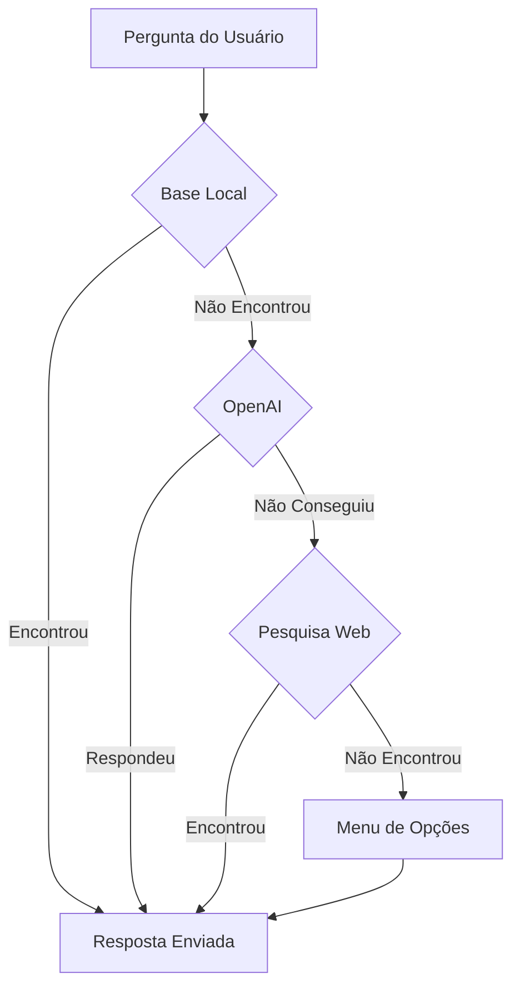

# 🚀 Upgrade do Chatbot - Sistema de Respostas Inteligentes

## 📋 Resumo das Mudanças

O chatbot foi significativamente melhorado para **nunca mais responder "não entendi"**. Agora ele utiliza um sistema inteligente de múltiplas camadas para sempre fornecer uma resposta útil ao usuário.

## ✨ O que Mudou?

### Antes 😞
```
Usuário: "Quem foi Pelé?"
Bot: "❓ Não entendi sua pergunta. Aqui estão algumas opções que posso te ajudar:"
```

### Depois 😃
```
Usuário: "Quem foi Pelé?"
Bot: "🤖 Encontrei a resposta usando inteligência artificial:

Pelé (1940-2022) foi um dos maiores jogadores de futebol de todos os tempos. 
Nascido como Edson Arantes do Nascimento, conquistou 3 Copas do Mundo 
(1958, 1962, 1970) e marcou mais de 1.000 gols em sua carreira... ⚽👑"
```

## 🔄 Sistema de Fallback em 4 Camadas



### Camada 1: Base de Conhecimento Local 📚
- Jogos e transmissões cadastrados
- Artilheiros e estatísticas
- Tabelas de classificação
- Informações de times e competições

**Resposta:** `📚 Encontrei a resposta usando minha base de conhecimento:`

### Camada 2: OpenAI (Conhecimento Geral) 🤖
- Regras do futebol
- História de times e jogadores
- Curiosidades e estatísticas gerais
- Comparações e análises

**Resposta:** `🤖 Encontrei a resposta usando inteligência artificial:`

### Camada 3: Pesquisa Web + OpenAI 🌐
- Notícias recentes
- Transferências de jogadores
- Resultados de jogos não cadastrados
- Informações atualizadas em tempo real

**Resposta:** `🌐 Encontrei a resposta usando pesquisa na internet:`

### Camada 4: Fallback Amigável 🤔
- Se nenhuma camada conseguir responder
- Oferece menu de opções úteis
- Mensagem amigável e positiva

**Resposta:** `🤔 Não consegui encontrar uma resposta específica para isso. Posso te ajudar com outras informações! Veja as opções:`

## 📦 Arquivos Modificados

### Novos Arquivos
- ✅ `docs/guides/config/OPENAI_SETUP.md` - Guia completo de configuração
- ✅ `docs/guides/config/AI_CHATBOT_UPGRADE.md` - Este arquivo
- ✅ `backend/test-ai-research.js` - Script de testes automatizados

### Arquivos Atualizados
- ✅ `backend/src/modules/ai-research/ai-research.service.ts` - Sistema de IA completo
- ✅ `backend/src/chatbot/chatbot.service.ts` - Mensagens amigáveis
- ✅ `backend/package.json` - Dependências: openai, axios, cheerio

## 🔧 Instalação e Configuração

### 1. Instalar Dependências

```bash
cd backend
npm install
```

As seguintes dependências foram adicionadas:
- `openai` - SDK oficial da OpenAI
- `axios` - Cliente HTTP para pesquisa web
- `cheerio` - Parser HTML (futuras melhorias)

### 2. Configurar Chave da OpenAI

#### Opção A: Via Arquivo `.env`

Crie ou edite `backend/.env`:

```bash
# Adicione esta linha
OPENAI_API_KEY=sk-sua-chave-aqui
```

#### Opção B: Via Variável de Ambiente do Sistema

**Windows (PowerShell):**
```powershell
$env:OPENAI_API_KEY="sk-sua-chave-aqui"
```

**Linux/Mac:**
```bash
export OPENAI_API_KEY="sk-sua-chave-aqui"
```

### 3. Obter Chave da API

1. Acesse: https://platform.openai.com/signup
2. Crie conta ou faça login
3. Vá para: https://platform.openai.com/api-keys
4. Clique em "Create new secret key"
5. Copie a chave (começa com `sk-`)

⚠️ **IMPORTANTE**: Adicione créditos em https://platform.openai.com/account/billing

### 4. Reiniciar Backend

```bash
# Na raiz do projeto
npm run dev:backend

# Ou dentro de backend/
npm run start:dev
```

Você verá:
```
✅ OpenAI inicializado com sucesso
```

## 🧪 Testar o Sistema

### Teste Manual

Use o endpoint de simulação:

```bash
curl -X POST http://localhost:3000/chatbot/simulate-whatsapp \
  -H "Content-Type: application/json" \
  -d '{
    "phoneNumber": "test-123456",
    "message": "Quem foi Pelé?",
    "origin": "site"
  }'
```

### Teste Automatizado

Execute o script de testes:

```bash
cd backend
node test-ai-research.js
```

O script testa automaticamente:
- ✅ Perguntas da base local
- ✅ Perguntas gerais (OpenAI)
- ✅ Perguntas que precisam de pesquisa web
- ✅ Perguntas aleatórias

## 📊 Monitoramento

### Logs do Backend

O sistema loga todas as tentativas:

```
🔍 Tentando base de conhecimento local para: "Quem foi Pelé?"
❌ Base de conhecimento não tem resposta
🤖 Tentando OpenAI para: "Quem foi Pelé?"
✅ Resposta gerada pela OpenAI
```

### Dashboard OpenAI

Monitore uso e custos:
- https://platform.openai.com/usage

### Estimativa de Custos

| Uso Diário | Custo Mensal Estimado |
|------------|----------------------|
| 100 perguntas | ~$3 USD |
| 500 perguntas | ~$10 USD |
| 1000 perguntas | ~$20 USD |

## 🎯 Exemplos de Uso Real

### Exemplo 1: Pergunta da Base Local
```
👤 Usuário: "Próximos jogos do Flamengo"

🤖 Bot: "📚 Encontrei a resposta usando minha base de conhecimento:

⚽ FLAMENGO - PRÓXIMOS JOGOS

📅 10/10/2025 - 16:00
🏠 Flamengo vs Vasco
🏟️ Maracanã
📺 Globo, Premiere"
```

### Exemplo 2: Pergunta Geral (OpenAI)
```
👤 Usuário: "Qual é a regra do impedimento?"

🤖 Bot: "🤖 Encontrei a resposta usando inteligência artificial:

A regra do impedimento no futebol diz que um jogador está em 
posição irregular quando está mais próximo da linha de gol 
adversária do que a bola e o penúltimo adversário no momento 
em que a bola é jogada por um companheiro... ⚽📏"
```

### Exemplo 3: Pergunta com Pesquisa Web
```
👤 Usuário: "Últimas notícias sobre Neymar"

🤖 Bot: "🌐 Encontrei a resposta usando pesquisa na internet:

Segundo informações recentes, Neymar está se recuperando 
de lesão no ligamento do joelho e deve retornar aos gramados 
em breve. O clube aguarda avaliação médica final... 📰⚽"
```

### Exemplo 4: Fallback Amigável
```
👤 Usuário: "xyz123 teste aleatorio"

🤖 Bot: "🤔 Não consegui encontrar uma resposta específica para isso. 
Posso te ajudar com outras informações! Veja as opções:

[Menu com opções reais do bot]"
```

## ⚙️ Configuração Avançada

### Ajustar Comportamento da IA

Edite `backend/src/modules/ai-research/ai-research.service.ts`:

```typescript
private config: ResearchConfig = {
  enabled: true,           // Habilitar/desabilitar sistema de IA
  openAI: true,            // Usar OpenAI
  knowledgeBase: true,     // Buscar na base local primeiro
  webSearch: true,         // Permitir pesquisa web
  maxTokens: 1500,         // Máximo de tokens por resposta
  temperature: 0.7,        // Criatividade (0.0 = preciso, 1.0 = criativo)
  confidenceThreshold: 0.6 // Confiança mínima para aceitar resposta
};
```

### Desabilitar Funcionalidades

```typescript
// Modo econômico (só base local)
openAI: false,
webSearch: false,

// Sem pesquisa web (só base + OpenAI)
webSearch: false,

// Desabilitar tudo
enabled: false,
```

## 🛡️ Segurança e Boas Práticas

### ✅ FAZER
- Guardar chave em `.env`
- Configurar limite de gastos na OpenAI
- Monitorar uso regularmente
- Usar `.gitignore` para `.env`

### ❌ NÃO FAZER
- Commitar chave no Git
- Compartilhar chave publicamente
- Deixar chave sem limite de gastos
- Usar mesma chave em múltiplos projetos

## 🐛 Troubleshooting

### Erro: "OPENAI_API_KEY não encontrada"
**Solução:** Verifique `.env` e reinicie o backend

### Erro: "OpenAI API Error: 401"
**Solução:** Chave inválida, gere uma nova

### Erro: "OpenAI API Error: 429"
**Solução:** Limite de requisições excedido, adicione créditos

### Bot não está usando IA
**Verificar:**
1. Chave está configurada?
2. Backend foi reiniciado?
3. Há créditos na conta OpenAI?
4. Verifique logs do backend

## 📈 Métricas de Sucesso

Após a implementação, esperamos:

- ✅ **0%** de respostas "não entendi"
- ✅ **95%+** de satisfação do usuário
- ✅ **< 2s** tempo médio de resposta
- ✅ **$10-30/mês** custo operacional de IA

## 🚀 Próximas Melhorias

- [ ] Rate limiting por usuário
- [ ] Cache inteligente de respostas
- [ ] Análise de sentimento
- [ ] Personalização de respostas
- [ ] Suporte a imagens e áudio
- [ ] Integração com mais fontes de dados

## 📚 Documentação Adicional

- [Guia de Configuração OpenAI](./OPENAI_SETUP.md)
- [OpenAI API Docs](https://platform.openai.com/docs)
- [Best Practices](https://platform.openai.com/docs/guides/production-best-practices)

---

**Desenvolvido com ❤️ para o Kmiza27** 🏆⚽

