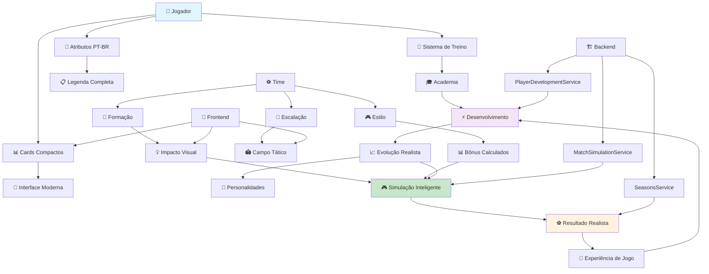

# 🏗️ DIAGRAMA DE ARQUITETURA - kmiza27-game

## 📊 **VISÃO GERAL DO SISTEMA**

Este diagrama mostra como os novos sistemas implementados se integram na arquitetura do jogo.

## 🎯 **FLUXO PRINCIPAL**



## 🔧 **ARQUITETURA TÉCNICA**

### **Backend (NestJS)**
```
kmiza27-game/backend/src/modules/
├── match-simulation/          # 🎮 Simulação Avançada
│   ├── match-simulation.service.ts
│   └── match-simulation.module.ts
│
├── player-development/        # 🌱 Evolução dos Jogadores
│   ├── player-development.service.ts
│   └── player-development.module.ts
│
├── seasons/                   # ⚽ Temporadas (melhorado)
│   ├── seasons.service.ts     # + simulateMatchWithTactics()
│   ├── seasons.controller.ts  # + integração com táticas
│   └── seasons.module.ts
│
├── tactics/                   # 🎯 Táticas (existente)
│   ├── tactics.service.ts
│   └── tactics.module.ts
│
└── youth-academy/             # 🎓 Academia (melhorado)
    ├── youth-academy.service.ts
    └── youth-academy.module.ts
```

### **Frontend (React/Next.js)**
```
kmiza27-game/frontend/src/components/
├── PlayerCardCompact.tsx           # 📊 Cards modernos
├── PlayerAttributesLegend.tsx      # 📋 Legenda PT-BR
├── PlayersManagerReformed.tsx      # 👥 Gerenciador completo
├── TacticsBoard.tsx               # 🎯 Área técnica (melhorado)
├── TacticsImpactDisplay.tsx       # 💡 Visualização de impacto
└── YouthAcademy.tsx              # 🎓 Academia (existente)
```

## 📊 **FLUXO DE DADOS**

### **1. Desenvolvimento de Jogadores**
```
Jogador → Academia → Treino Semanal → Evolução → Experiência de Jogo
    ↓         ↓            ↓             ↓              ↓
Interface → Foco/Int. → Cálculos → Atributos → Performance
```

### **2. Sistema de Táticas**
```
Usuário → Escalação → Formação → Estilo → Simulação → Resultado
    ↓         ↓          ↓         ↓         ↓          ↓
Interface → Lineup → Bônus → Modific. → Engine → Experience
```

### **3. Simulação de Partidas**
```
Time + Táticas + Jogadores → MatchSimulationService → Resultado
    ↓         ↓         ↓              ↓                  ↓
 Força   Bônus   Estado        Cálculo Complex.    XP + Stats
```

## 🎮 **COMPONENTES PRINCIPAIS**

### **📊 PlayerCardCompact**
```typescript
interface PlayerCardData {
  // Dados básicos
  id: string;
  name: string;
  position: string;
  age: number;
  overall: number;
  
  // Atributos PT-BR
  attributes: {
    PAC: number;  // Ritmo
    FIN: number;  // Finalização
    PAS: number;  // Passe
    DRI: number;  // Drible
    DEF: number;  // Defesa
    FIS: number;  // Físico
    GOL?: number; // Goleiro
  };
  
  // Estado atual
  morale?: number;
  fitness?: number;
  fatigue?: number;
  is_in_academy?: boolean;
}
```

### **🎯 MatchSimulationService**
```typescript
interface MatchSimulationResult {
  homeScore: number;
  awayScore: number;
  highlights: any[];
  playerRatings: Record<string, number>;
  tacticalImpact: {
    homeAdvantage: number;
    tacticalBonus: number;
    individualPerformances: Record<string, number>;
  };
}
```

### **🌱 PlayerDevelopmentService**
```typescript
interface PlayerDevelopmentData {
  // ... dados do jogador
  
  // Sistema de treino
  training_focus?: 'PAC' | 'FIN' | 'PAS' | 'DRI' | 'DEF' | 'FIS' | 'GOL';
  training_intensity?: 'baixa' | 'normal' | 'alta';
  
  // Personalidade
  personality?: 'trabalhador' | 'preguicoso' | 'lider' | 'temperamental';
}
```

## 🔄 **INTEGRAÇÃO ENTRE SISTEMAS**

### **Como os Sistemas se Comunicam:**

1. **Táticas → Simulação**
   - `TacticsBoard` salva táticas
   - `MatchSimulationService` lê táticas
   - Aplica modificadores na simulação

2. **Desenvolvimento → Performance**
   - `PlayerDevelopmentService` evolui jogadores
   - Novos atributos afetam simulação
   - Experiência de jogo gera mais evolução

3. **Interface → Backend**
   - `PlayerCardCompact` mostra dados
   - Actions disparam APIs
   - Estado atualizado em tempo real

## 📈 **MÉTRICAS E MONITORAMENTO**

### **Logs Importantes:**
```
🎮 REFORM: Logs do sistema reformulado
🎯 USER-SERIE: Logs da série do usuário  
⚽ MATCH: Logs de partidas
🌱 DEVELOPMENT: Logs de evolução
📊 TACTICS: Logs de impacto tático
```

### **Endpoints-Chave:**
```
POST /api/v2/seasons/simulate-match  # Simula com táticas
POST /api/v2/academy/apply-week      # Aplica treino semanal
PUT  /api/v2/tactics                 # Salva táticas
GET  /api/v2/players                 # Lista jogadores
```

## 🚀 **PERFORMANCE E OTIMIZAÇÕES**

### **Características de Performance:**
- ✅ **Simulação em lote** - múltiplos jogadores processados juntos
- ✅ **Cache de táticas** - evita reprocessamento
- ✅ **Lazy loading** - componentes carregados sob demanda
- ✅ **Parallel tool calls** - operações simultâneas no backend

### **Otimizações de UI:**
- 📱 **Cards responsivos** - adaptam ao tamanho da tela
- 🎨 **Cores dinâmicas** - baseadas em performance
- ⚡ **Updates em tempo real** - feedback imediato
- 🔄 **Estados visuais** - loading, error, success

## 🔮 **EXTENSIBILIDADE**

### **Como Adicionar Novos Sistemas:**

1. **Novo Módulo Backend:**
   ```typescript
   // backend/src/modules/new-system/
   ├── new-system.service.ts
   ├── new-system.controller.ts
   └── new-system.module.ts
   ```

2. **Novo Componente Frontend:**
   ```typescript
   // frontend/src/components/
   └── NewSystemComponent.tsx
   ```

3. **Integração:**
   - Adicionar ao `app.module.ts`
   - Exportar no store se necessário
   - Documentar em `SISTEMAS_IMPLEMENTADOS.md`

---

## 📚 **PARA FUTURAS IAs**

### **🎯 Pontos de Entrada:**
1. **Leia GUIA_IA_GAME.md** - conceito geral
2. **Consulte este arquivo** - arquitetura visual
3. **Veja SISTEMAS_IMPLEMENTADOS.md** - detalhes técnicos
4. **Explore os módulos** - código organizado em `modules/`

### **🔍 Como Debuggar:**
1. **Logs estruturados** - cada sistema tem prefixo específico
2. **Console.log no frontend** - estados e ações
3. **Network tab** - APIs e payloads
4. **Componentes isolados** - testáveis individualmente

---

**🎮 Este diagrama representa a evolução do projeto de um Elifoot simples para um gerenciador moderno e estratégico! ⚽**
